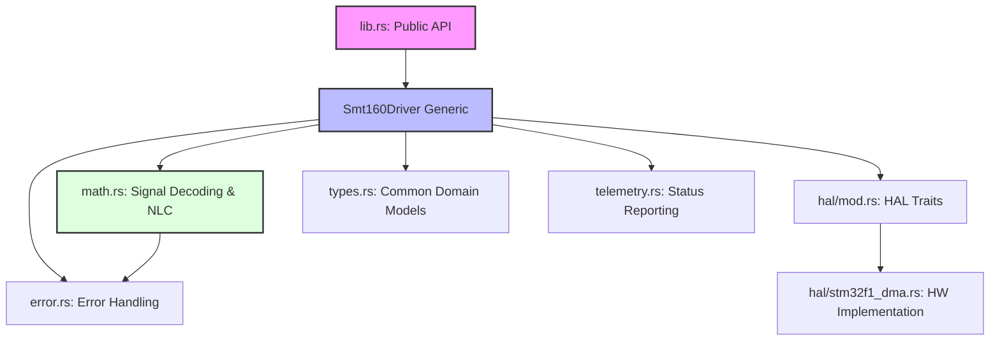
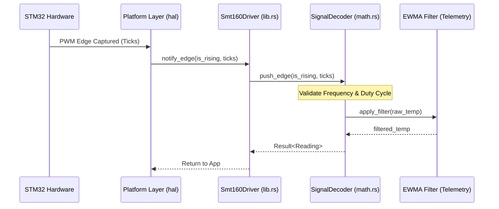

# 📐 SMT160-Driver Architecture Reference

This document details the internal design and module relationships of the `smt160-driver`, emphasizing the **Self-Documenting Clean Architecture** principles used to achieve industrial-grade reliability.

---

## 🧱 Module Hierarchy

The driver follows a strict layered architecture to decouple mathematical logic from hardware peripherals.

---

## 🔄 Data Flow Sequence

The following diagram illustrates the lifecycle of a temperature reading from a hardware interrupt to a filtered domain model.

---

## 📐 Core Architecture Principles

### 1. Multi-Layered Separation
The driver is strictly decoupled into three distinct layers to ensure portability and testability:
- **Logic Layer (`math.rs`)**: Contains the pure mathematical state machine for PWM decoding and non-linearity correction. It is completely side-effect free and platform-agnostic.
- **Abstraction Layer (`hal/mod.rs`)**: Defines the `Smt160TimerInstance` and `Smt160DmaChannel` traits, allowing the core driver logic to interact with hardware in a generic way.
- **Platform Layer (`hal/*.rs`)**: Contains specific hardware implementations (e.g., `stm32f1_dma.rs` for STM32F1 PWM input capture) that satisfy the Abstraction Layer traits.

### 2. High-Integrity Data Modeling
- **`Reading`**: A standardized output structure that couples the temperature value with bit-flagged status metadata.
- **`Smt160Status`**: A bitfield allowing for simultaneous reporting of multiple hazards (e.g., Signal Loss + High Jitter).
- **`Smt160Error`**: A unified error enum with detailed human-readable descriptions for diagnostic clarity.

### 3. Arithmetic Strategy: Fixed-Point Determinism
To ensure bit-perfect consistency across different CPU architectures (with or without FPU), this driver uses **fixed-point arithmetic** via the `fixed` crate:
- **`I32F32`**: Used for high-precision intermediate calculations (Duty Cycle, Multipliers).
- **`I16F16`**: Used for final temperature representation and filtering to save memory/cycles while maintaining 0.001°C resolution.

---

## 🛠️ Self-Documenting Code Standards

The project follows strict naming and documentation standards to ensure the code is "self-documenting" for safety audits:

### 1. Domain-Accurate Naming
Abbreviations are prohibited in public APIs. Names must reflect their physical or logical domain:
- ✅ `temperature_celsius` (Physical)
- ✅ `timer_clock_megahertz` (Hardware)
- ✅ `inverse_step_constant` (Mathematical)
- ❌ `temp`, `mhz`, `val`, `cfg`

### 2. Documentation Requirements
Every public item must include a `///` docstring containing:
1. **Summary**: A one-line description of the item.
2. **Errors**: Explicit documentation of failure modes (if applicable).
3. **Panics**: Documentation of any edge cases that could cause a crash (targeted to be empty).
4. **Usage Example**: A standalone snippet demonstrating the item in context.

---

## 🛡️ Safety & Reliability Mechanisms

- **Boundary Validation**: The decoding engine strictly enforces physical sensor limits (0.320-0.980 duty cycle) at every sample.
- **Frequency Monitoring**: Ensures the sensor is operating within its specified 1kHz-4kHz range, detecting potential oscillator failures.
- **Adaptive Filtering**: An Exponentially Weighted Moving Average (EWMA) filter that automatically adjusts response speed based on signal volatility, ensuring fast response to real changes while rejecting noise.
- **Persistent Calibration**: Non-linearity correction is applied within `math.rs` using a pre-defined lookup table, ensuring consistent calibration without external storage.
