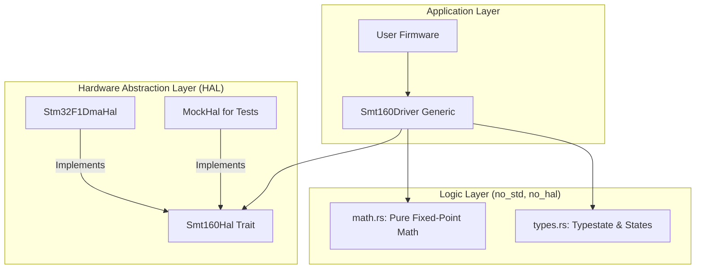
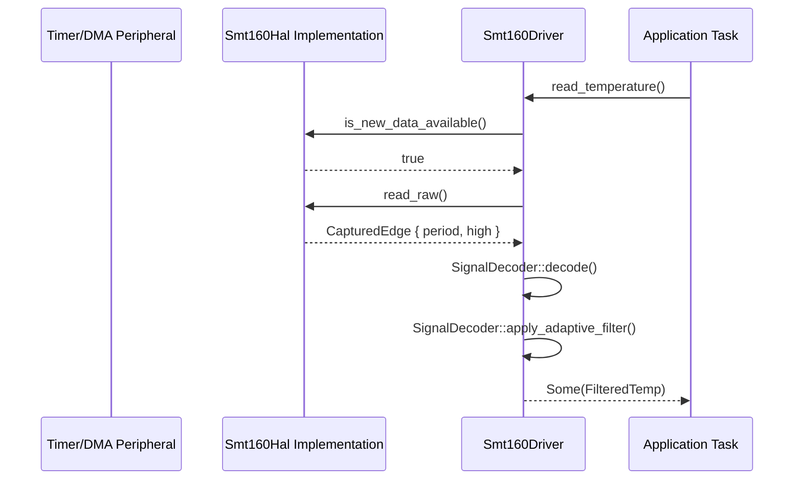

# 🏗️ SMT160-Driver Architecture Reference

This document provides a comprehensive overview of the internal design, module relationships, and data flow of the `smt160-driver`. The project is built on the principles of **Dependency Injection** and **Typestate Safety**.

## 🧱 Module Hierarchy

The driver is organized into a strictly decoupled hierarchy, ensuring that high-level logic never depends directly on low-level hardware registers.

---

## 🔄 Core Data Flow (State-Telemetry Pattern)

The driver follows a **State-Telemetry Pattern** to ensure data consistency across asynchronous tasks or polling loops.

1.  **Capture**: The `Smt160Hal` measures PWM edges and provides raw ticks via DMA or Interrupts.
2.  **Decode**: The `Smt160Driver` retrieves these ticks and processes them using `SignalDecoder` (math.rs).
3.  **Filter**: Readings are passed through an **Adaptive EWMA Filter** which adjusts its responsiveness based on thermal deviation.
4.  **Observe**: Health metrics (Jitter, Timeout, Out-of-Bounds) are updated in the `Smt160Status` bitfield.

### 📈 PWM Decoding Sequence

---

## 🛠️ Key Architectural Components

### 1. `Smt160Driver<H, S>` (The Generic Orchestrator)
The driver is generic over the hardware implementation `H` and its current state `S`. This allows for compile-time safety (preventing reads before initialization) and easy swapping of hardware backends.

### 2. `Smt160Hal` Trait
This trait defines the contract for hardware integration. It requires:
- `setup(freq)`: Hardware-specific initialization.
- `is_new_data_available()`: Non-blocking check for new capture data.
- `read_raw()`: Retrieval of the latest `CapturedEdge`.

### 3. Adaptive EWMA Filter
To balance responsiveness and noise rejection, the driver uses an adaptive alpha value:
- **Fast Track (α=0.8)**: Triggered during startup or when a >5°C jump is detected.
- **Steady State (α=0.1)**: Used for precise, filtered monitoring during stable periods.

### 4. Fixed-Point Arithmetic Strategy
To avoid non-deterministic behavior and the overhead of an FPU, we use:
- **`I32F32`**: For all calculations, providing 32 bits of fractional precision (approx. 9 decimal places).

---

## 🛡️ Safety & Integrity Mechanisms

- **Typestate Pattern**: Transitions the driver from `Uninitialized` to `Ready` only after successful hardware setup.
- **Jitter Detection**: Compares subsequent period captures against a configurable percentage threshold to flag signal interference.
- **Autonomous Watchdog**: Detects sensor flatline (signal loss) and triggers status flags for system-level recovery.

> [!NOTE]
> For more visual representations of these components, see the [Diagrams repository](Diagrams.md).

---

## 🛡️ Safety & Integrity Mechanisms

- **Consistent Read 64-bit Timestamps**: Implemented in the STM32 layer to prevent race conditions during 16-bit timer overflows.
- **Atomic Health Monitoring**: Uses `AtomicU32` and `AtomicU64` to allow concurrent health telemetry without locking.
- **Piecewise Linear Interpolation**: Allows for 5-point calibration correction to overcome sensor-specific manufacturing variations.

> [!NOTE]
> For more visual representations of these components, see the [Diagrams repository](Diagrams.md).
