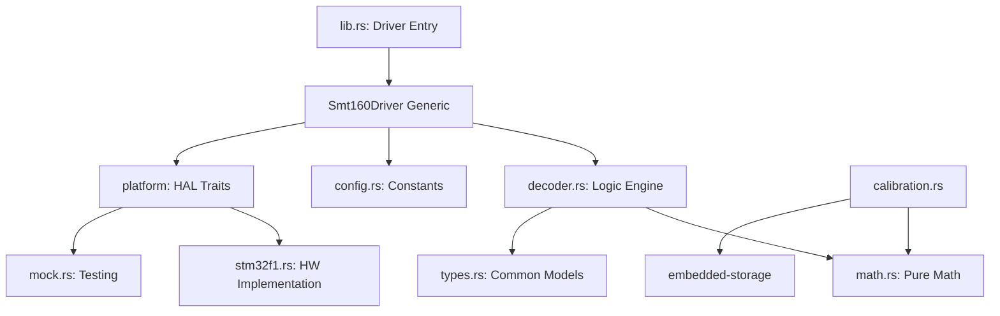

# SMT160-Driver Architecture Reference

This document details the internal design and module relationships of the `smt160-driver`, emphasizing the **Self-Documenting Clean Architecture** principles used to achieve industrial-grade reliability.

## 🧱 Module Hierarchy

## 📐 Core Architecture Principles

### 1. Separation of Concerns
The driver is strictly decoupled into three layers:
- **Logic Layer (`decoder.rs`, `math.rs`)**: Contains the pure mathematical state machine for PWM decoding. It has no knowledge of pins or timers.
- **Abstraction Layer (`platform/mod.rs`)**: Defines the `CaptureDevice` trait, allowing the logic layer to interact with hardware in a generic way.
- **Platform Layer (`platform/*.rs`)**: Contains specific hardware implementations (e.g., STM32F1 PWM input capture).

### 2. High-Integrity Data Types
- **`Reading`**: Standardized output structure containing the temperature and bit-flagged status.
- **`Smt160Status`**: A bitfield allowing for simultaneous reporting of multiple hazards (e.g., Signal Loss + High Jitter).
- **`Smt160Error`**: A unified error enum with detailed human-readable descriptions via `fmt::Display`.

### 3. Safety Hardening
- **Critical Sections**: All hardware-specific operations that could cause race conditions or memory faults (like Flash writes) are wrapped in `critical-section` guards.
- **Atomic Timestamps**: 64-bit timestamps are stitched using a "Consistent Read Pattern" to prevent time discontinuities during timer overflows.
- **Adaptive EWMA**: The filtering logic automatically adjusts its smoothing factor based on reading deviation to balance noise rejection with response speed.

## 🛠️ Internal Naming Standards

The project strictly avoids abbreviations to ensure maximum clarity during code audits:
- ✅ `temperature_celsius`
- ✅ `duty_cycle_offset`
- ✅ `inverse_step_constant`
- ❌ `temp`
- ❌ `dc`
- ❌ `cfg`

## 📡 Telemetry Design

The driver supports two forms of observability:
1. **In-Band Status**: Every `Reading` includes the `Smt160Status` flags.
2. **Out-of-Band Health**: The `Smt160Health` monitor tracks system performance (jitter, drift) over long durations, accessible via `get_diagnostic_health()`.
