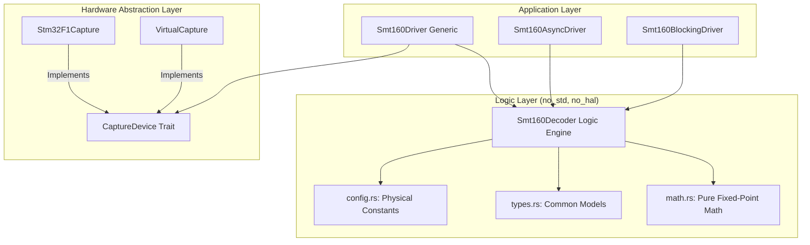
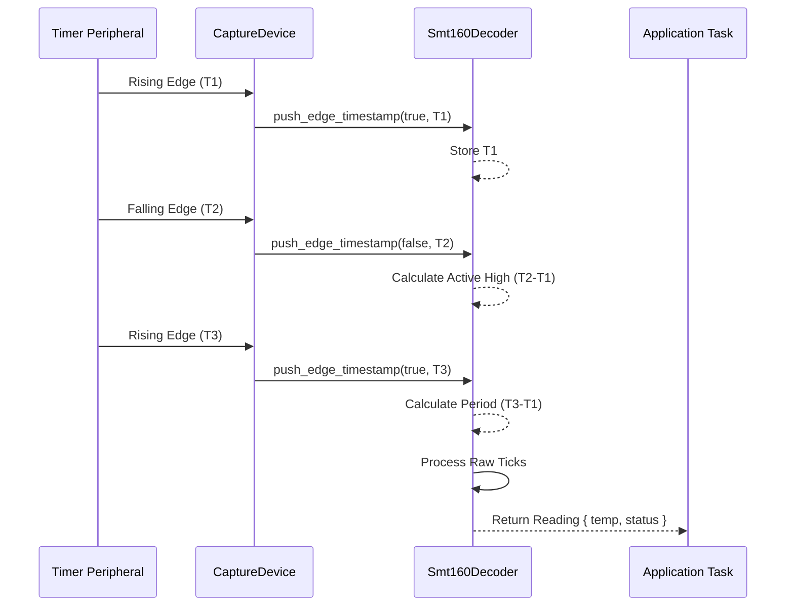

# 🏗️ SMT160-Driver Architecture Reference

This document provides a comprehensive overview of the internal design, module relationships, and data flow of the `smt160-driver`. The project is built on the principles of **Self-Documenting Clean Architecture** to ensure industrial-grade reliability and auditability.

## 🧱 Module Hierarchy

The driver is organized into a strictly decoupled hierarchy, ensuring that high-level logic never depends directly on low-level hardware registers.

---

## 🔄 Core Data Flow (State-Telemetry Pattern)

The driver follows a **State-Telemetry Pattern** to ensure data consistency across asynchronous tasks.

1.  **Capture**: The `CaptureDevice` measures PWM edges and provides raw ticks.
2.  **Decode**: The `Smt160Decoder` processes these ticks using fixed-point math to derive temperature.
3.  **Validate**: Readings are checked against industrial safety boundaries and frequency drift limits.
4.  **Observe**: Health metrics (Jitter RMS, Samples) are updated atomically for external monitoring.

### 📈 PWM Decoding Sequence

---

## 🛠️ Key Architectural Components

### 1. `Smt160Decoder` (The Passive Logic Core)
The heart of the driver is a passive state machine. It has **no knowledge of time units** or hardware registers. It only knows about "ticks". This makes it perfectly suitable for unit testing with mocked capture data.

### 2. `CaptureDevice` Trait
This trait defines the contract for hardware integration. It requires:
- `get_capture_data()`: Atomic retrieval of the latest period and active-high ticks.
- `wait_for_new_data()`: An async hook that suspends the task until a full PWM cycle is captured.

### 3. Fixed-Point Arithmetic Strategy
To avoid non-deterministic behavior and the overhead of an FPU, we use:
- **`I32F32`**: For intermediate duty cycle and temperature calculations (64-bit precision).
- **`I16F16`**: For the final temperature output and filtering, providing ±0.000015°C theoretical resolution.

---

## 🛡️ Safety & Integrity Mechanisms

- **Consistent Read 64-bit Timestamps**: Implemented in the STM32 layer to prevent race conditions during 16-bit timer overflows.
- **Atomic Health Monitoring**: Uses `AtomicU32` and `AtomicU64` to allow concurrent health telemetry without locking.
- **Piecewise Linear Interpolation**: Allows for 5-point calibration correction to overcome sensor-specific manufacturing variations.

> [!NOTE]
> For more visual representations of these components, see the [Diagrams repository](Diagrams.md).
