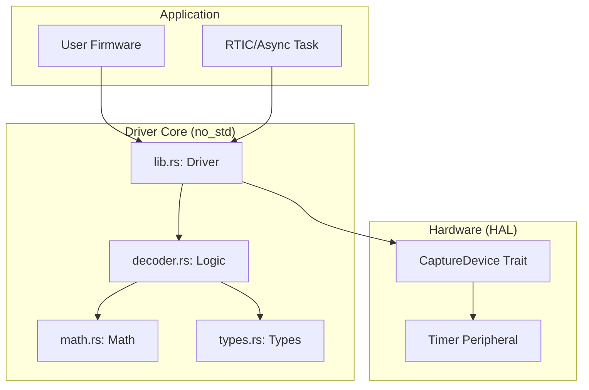
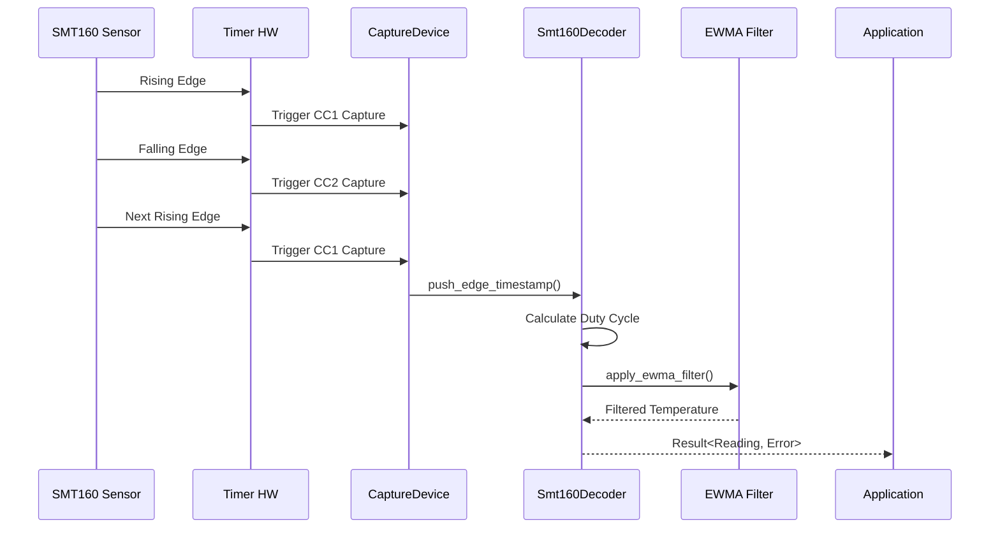
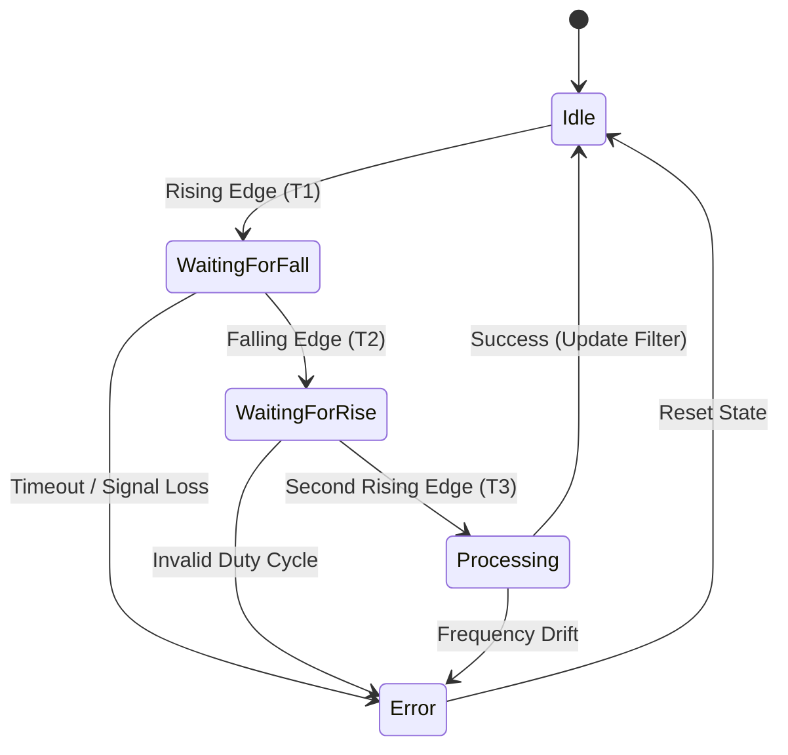
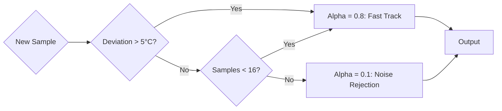

# 📊 SMT160-Driver Visual Documentation

This document serves as a centralized repository for all Mermaid diagrams describing the architecture, signal processing flows, and state transitions of the SMT160 driver.

## 🏗️ Architectural Overview

### System Module Relationships
Describes how the different crates and modules interact to form the full driver stack.

---

## 📡 Signal Processing Flow

### PWM Edge Capture to Temperature Output
Illustrates the sequence of events from a physical edge on the pin to a filtered temperature reading.

---

## 🔄 State Machine Logic

### Decoder Internal Transitions
Shows how the decoder handles incomplete cycles and potential errors.

---

## 📈 Adaptive Filtering Behavior

### Filter Alpha Selection Logic
Visualizes how the driver balances responsiveness with noise rejection.

