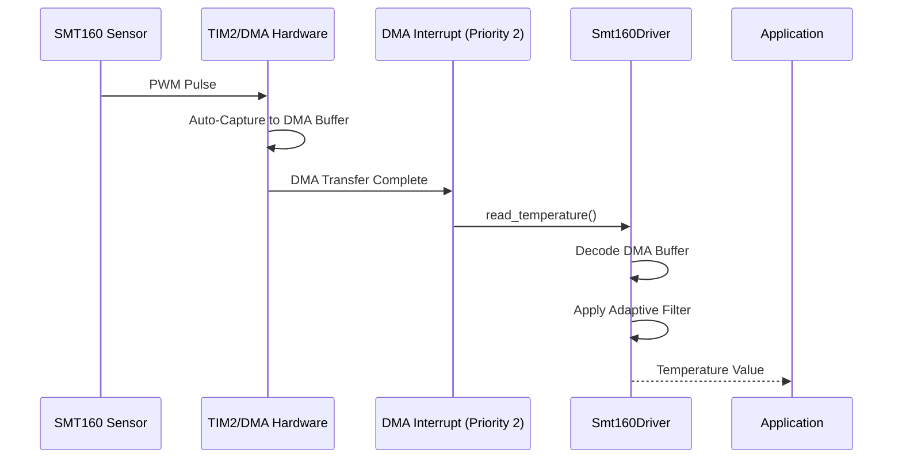

# ⚡ RTIC 2.1 Integration Guide for SMT160-Driver

This guide details how to integrate the `smt160-driver` into an RTIC 2.1 project using the **DMA-based Hardware Abstraction Layer**. This approach ensures zero-jitter capture by utilizing hardware DMA to transfer pulse-width values directly to memory, bypassing the CPU for timing-critical tasks.

## 📦 Prerequisites

Ensure your `Cargo.toml` includes the necessary RTIC and driver dependencies:

```toml
[dependencies]
smt160-driver = { version = "0.1.0", features = ["stm32f1"] }
rtic = "2.1"
rtic-monotonics = { version = "0.1", features = ["systick"] }
```

## 🏗️ Architectural Overview

In an RTIC application, the driver is typically split across:
1.  **DMA Interrupt Task**: High-priority task triggered when new data is captured by DMA.
2.  **Health/Watchdog Task**: Lower-priority task for monitoring sensor status and performing auto-recovery.

---

## 🛠️ Implementation Example (STM32F1)

### 1. Resource Definition

```rust
#[rtic::app(device = stm32f1xx_hal::pac, dispatchers = [USART1])]
mod app {
    use smt160_driver::hal::stm32f1_dma::Stm32F1DmaHal;
    use smt160_driver::{Smt160Driver, Ready, Config};

    #[shared]
    struct Shared {
        // The driver is generic over the HAL implementation
        driver: Smt160Driver<Stm32F1DmaHal<pac::TIM2, stm32f1xx_hal::dma::dma1::C4>, Ready>,
    }

    #[local]
    struct Local {}
}
```

### 2. Initialization

```rust
#[init]
fn init(cx: init::Context) -> (Shared, Local) {
    // ... Clock configuration (e.g., 72MHz) ...

    // 1. Static DMA Buffer for circular capture
    static mut DMA_BUFFER: [u32; 4] = [0; 4];

    // 2. Initialize DMA and Timer
    let dma1 = cx.device.DMA1.split(&mut rcc);
    let hal = Stm32F1DmaHal::new(cx.device.TIM2, dma1.4, unsafe { &mut DMA_BUFFER });

    // 3. Create and Initialize Driver
    let driver = Smt160Driver::new(hal, Config::industrial())
        .init(72_000_000)
        .expect("Hardware init failed");

    (Shared { driver }, Local {})
}
```

### 3. Handling DMA Interrupts

The DMA interrupt is triggered when the buffer is half-full or full, ensuring we always process the latest coherent capture.

```rust
#[task(binds = DMA1_CHANNEL4, shared = [driver], priority = 2)]
fn on_dma(mut cx: on_dma::Context) {
    cx.shared.driver.lock(|driver| {
        if let Some(temperature) = driver.read_temperature() {
            // temperature is a fixed-point I32F32
            defmt::info!("Temp: {} °C", temperature.to_num::<f32>());
        }
    });
}
```

### 4. Background Health Monitoring

```rust
#[task(shared = [driver], priority = 1)]
async fn watchdog(mut cx: watchdog::Context) {
    loop {
        Mono::delay(100.millis()).await;
        
        cx.shared.driver.lock(|driver| {
            let status = driver.status();
            if status.contains(Smt160Status::SENSOR_TIMEOUT) {
                // Perform autonomous recovery
                let _ = driver.init(72_000_000);
            }
        });
    }
}
```

---

## 🛡️ Best Practices for RTIC

-   **Priority Assignment**: The DMA interrupt should have a medium-to-high priority (e.g., 2 or 3) to ensure timely processing of the buffer.
-   **Lock Duration**: Keep the `driver` lock short. The `read_temperature()` call is highly optimized and non-blocking.
-   **Memory Safety**: Always use a `static mut` buffer for DMA to ensure the memory is valid for the duration of the application.

---

## 📊 Sequence Diagram: DMA Flow


