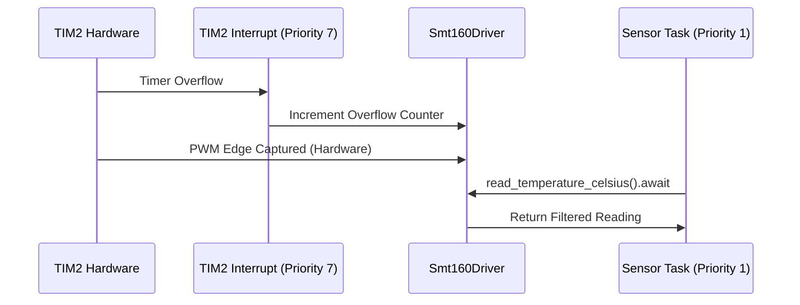

# ⚡ RTIC 2.1 Integration Guide for SMT160-Driver

This guide details how to integrate the `smt160-driver` into a project using **Real-Time Interrupt-driven Concurrency (RTIC) 2.1**. This approach ensures the highest possible precision by utilizing hardware interrupts for edge capture while keeping processing non-blocking.

## 📦 Prerequisites

Ensure your `Cargo.toml` includes the necessary RTIC and driver dependencies:

```toml
[dependencies]
smt160-driver = { version = "0.1.0", features = ["stm32f1"] }
rtic = "2.1"
rtic-monotonics = { version = "0.1", features = ["systick"] }
```

## 🏗️ Architectural Overview

In an RTIC application, the driver is typically split across:
1.  **Hardware Task**: High-priority interrupt handler for capturing timer events.
2.  **Application Task**: Lower-priority task for processing temperature readings and updating system state.

---

## 🛠️ Implementation Example (STM32F1)

### 1. Resource Definition

Define your shared and local resources in the RTIC `#[app]` module.

```rust
#[rtic::app(device = stm32f1xx_hal::pac, dispatchers = [USART1])]
mod app {
    use smt160_driver::platform::stm32f1::Stm32F1Capture;
    use smt160_driver::Smt160Driver;
    use smt160_driver::config::StaticConfiguration;

    #[shared]
    struct Shared {
        // Share the driver or just the resulting readings
        latest_reading: Option<smt160_driver::Reading>,
    }

    #[local]
    struct Local {
        smt160: Smt160Driver<StaticConfiguration, Stm32F1Capture>,
    }

    // ... init and tasks ...
}
```

### 2. Initialization

Configure the timer and the driver during the `init` phase.

```rust
#[init]
fn init(cx: init::Context) -> (Shared, Local) {
    let mut flash = cx.device.FLASH;
    let rcc = cx.device.RCC.constrain();
    let clocks = rcc.cfgr.freeze(&mut flash.acr);

    // Initialize Timer for PWM Input Capture (TIM2)
    let capture = Stm32F1Capture::new(cx.device.TIM2);

    // Initialize SMT160 Driver (72MHz clock for STM32F1)
    let smt160 = Smt160Driver::new(StaticConfiguration, capture, 72);

    (
        Shared { latest_reading: None },
        Local { smt160 },
    )
}
```

### 3. Handling Timer Overflows (Critical for Precision)

The `Stm32F1Capture` requires consistent 64-bit timestamps. You must handle the timer update interrupt.

```rust
#[task(binds = TIM2, priority = 7, local = [])]
fn timer_handler(_cx: timer_handler::Context) {
    // Notify the driver of a timer overflow to stitch 64-bit timestamps
    Stm32F1Capture::handle_timer_overflow_interrupt();
}
```

### 4. Processing Sensor Data

Use a background task to poll the driver asynchronously.

```rust
#[task(priority = 1, local = [smt160], shared = [latest_reading])]
async fn sensor_task(mut cx: sensor_task::Context) {
    loop {
        // Non-blocking wait for a new PWM cycle
        match cx.local.smt160.read_temperature_celsius().await {
            Ok(reading) => {
                cx.shared.latest_reading.lock(|r| *r = Some(reading));
                // Handle logic based on temperature
            }
            Err(e) => {
                // Log diagnostic health or handle fault
                let health = cx.local.smt160.get_diagnostic_health();
            }
        }
    }
}
```

---

## 🛡️ Best Practices for RTIC

-   **Priority Assignment**: The timer interrupt should have a higher priority than the processing task to ensure no edges are missed.
-   **Locking**: Keep shared resource locks (like `latest_reading`) as short as possible to avoid jitter in other real-time tasks.
-   **Static Configuration**: In most industrial cases, use `StaticConfiguration` to save memory and avoid runtime lookup overhead.

> [!IMPORTANT]
> **Clock Synchronization**: Ensure the frequency passed to `Smt160Driver::new` (e.g., `72`) exactly matches the peripheral clock frequency of the timer used for capture.

---

## 📊 Sequence Diagram: RTIC Flow


